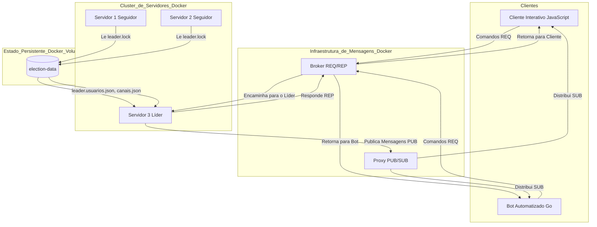

# Sistema de Chat Distribuído

Este é um projeto de um sistema de chat em tempo real, polyglot (Python, Go, JavaScript), construído sobre uma arquitetura de microsserviços tolerante a falhas. A aplicação utiliza ZeroMQ, Docker Compose e implementa conceitos avançados de sistemas distribuídos, como eleição de coordenador, replicação de estado e consistência.

## ✨ Features

* **Alta Disponibilidade:** Utiliza múltiplas réplicas do servidor e um algoritmo de eleição de Coordenador (Líder) para garantir que o sistema continue funcionando mesmo se o líder atual falhar.
* **Replicação de Estado:** O estado do sistema (usuários, canais) é replicado em um volume compartilhado (`election-data`), permitindo que um novo líder assuma o trabalho instantaneamente sem perda de dados.
* **Arquitetura Polyglot:** Demonstra a interoperabilidade entre diferentes linguagens:
    * **Servidor (Python):** O cérebro da aplicação, com a lógica de negócio e eleição.
    * **Cliente Interativo (JavaScript):** Interface de linha de comando para usuários.
    * **Bot Automatizado (Go):** Cliente não-humano que gera tráfego e é resiliente a falhas.
* **Segurança:** Implementa cadastro e login de usuários com hashing de senhas (`SHA256`) e sessões **stateless** (sem estado) via **JSON Web Tokens (JWT)**, permitindo que a autenticação funcione perfeitamente mesmo após a troca de líder.
* **Comunicação com ZeroMQ:** Utiliza dois padrões de comunicação distintos:
    * **Request-Reply:** Para comandos e operações síncronas.
    * **Publisher-Subscriber:** Para a distribuição de mensagens em tempo real.
* **Conceitos Implementados:**
    * **Relógios Lógicos (Lamport):** Cada requisição e resposta incrementa e sincroniza um contador de Lamport, garantindo a ordem causal dos eventos.
    * **Sincronização de Relógio (Berkeley):** O Líder atua como um Coordenador de tempo (`getTime`), permitindo que os clientes comparem seu relógio com o do servidor.
    * **Eleição de Coordenador:** Implementa o **Algoritmo do Valentão** adaptado para um mecanismo robusto de **Lock File** em um volume compartilhado, prevenindo "Split-Brain".
    * **Sincronização de Dados (Replicação):** O Líder escreve todas as alterações de estado (novos usuários, novos canais) no volume compartilhado. Um novo líder, ao ser eleito, lê esses arquivos e carrega o estado, garantindo a consistência e a replicação dos dados.

## 📐 Arquitetura

O sistema é orquestrado pelo Docker Compose e se baseia em um cluster de servidores com um único líder ativo.

1.  **Cluster de Servidores:** Múltiplas instâncias (`servidor-1`, `2`, `3`) competem pela liderança. Apenas o **Líder** se conecta aos brokers de trabalho e processa as requisições. Os **Seguidores** monitoram o líder.
2.  **Volume Compartilhado (`election-data`):** Atua como a fonte única da verdade para a eleição (através do `leader.lock`) e para o estado do sistema (`usuarios.json`, `canais.json`, `messages.log`).
3.  **Brokers ZeroMQ:** Dois brokers desacoplam a comunicação: um `ROUTER/DEALER` para comandos e um `XPUB/XSUB` para mensagens em tempo real.
4.  **Clientes (JavaScript e Go):** Clientes resilientes que sabem lidar com a falha temporária do líder, usando um `timeout` e tentando novamente.



## 🛠️ Pré-requisitos

* [Docker](https://www.docker.com/get-started) e Docker Compose
* [Go](https://go.dev/doc/install) (para gerar os arquivos `go.mod`/`go.sum` na primeira vez)

## 🚀 Como Rodar

1.  **Primeira Vez (Setup do Go):** Se for a primeira vez rodando o projeto, entre na pasta `proxy/` e prepare o módulo do Go:
    ```bash
    cd proxy
    go mod init bot-go
    go mod tidy
    cd ..
    ```

2.  **Limpeza (Opcional, mas Recomendado):** Para começar de um estado 100% limpo, na pasta raiz:
    ```bash
    docker compose down
    docker volume rm projetosistemasdistribuidos_election-data
    ```

3.  **Suba a Orquestra:** Na pasta raiz, construa e inicie todos os serviços. Deixe este terminal aberto para observar os logs.
    ```bash
    docker compose up --build
    ```
    *Observe a eleição acontecer! Apenas um servidor se tornará o LÍDER.*

4.  **Execute o Cliente Interativo:** Abra um **novo terminal** e rode o cliente em seu container:
    ```bash
    docker compose run --rm cliente-js
    ```
    *Siga as instruções para se cadastrar e fazer login.*

## 🔬 Como Testar a Alta Disponibilidade

1.  Com o sistema rodando, use o cliente para criar um usuário (`userA`) e um canal (`canal-teste`).
2.  Nos logs do `docker compose`, identifique qual servidor é o LÍDER (ex: `servidor-3-1`).
3.  Abra um **terceiro terminal** e derrube o líder de propósito:
    ```bash
    # Substitua pelo nome correto do container do seu líder
    docker stop projetosistemasdistribuidos-servidor-3-1 
    ```
4.  **Observe a Mágica:** Nos logs principais, você verá os seguidores detectarem a falha e um novo líder ser eleito.
5.  **Teste a Resiliência:** No terminal do cliente, o primeiro comando (ex: `listar_canais`) pode dar timeout. Tente o mesmo comando novamente.
6.  **Teste a Replicação:** O comando `listar_canais` **deve funcionar** e **mostrar o `canal-teste`** que você criou com o líder antigo. Tente fazer login com o `userA` em outro cliente: **deve funcionar**, provando que os dados foram 100% replicados.

---
Criado por: **Gabriel Balbine** - Novembro de 2025
