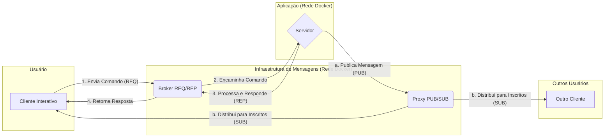

# Sistema de Chat Distribuído com ZeroMQ e Docker

Este é um projeto de um sistema de chat em tempo real construído com Python e ZeroMQ, utilizando uma arquitetura de microsserviços orquestrada com Docker Compose. A aplicação demonstra a combinação dos padrões Request-Reply (para comandos) e Publisher-Subscriber (para mensagens em tempo real).

## ✨ Features

* **Cadastro e Login de Usuários:** Sistema de autenticação seguro com hashing de senhas (`SHA256`) e sessões baseadas em token.
* **Criação de Canais:** Usuários autenticados podem criar canais de discussão.
* **Mensagens em Tempo Real:**
    * **Canais (Pub/Sub):** Envio de mensagens em canais públicos, onde múltiplos usuários podem se inscrever para receber as publicações em tempo real.
    * **Mensagens Diretas:** Envio de mensagens privadas de um usuário para outro.
* **Persistência de Dados:** Usuários, canais e o histórico de todas as mensagens são salvos em arquivos (`.json`, `.log`), garantindo que os dados não sejam perdidos quando o sistema é reiniciado.
* **Suporte a UTF-8:** Tratamento correto de caracteres especiais e acentuação.
* **Orquestração com Docker:** Todos os componentes da aplicação (servidor, brokers) são containerizados e gerenciados com um único arquivo `docker-compose.yml`.

## 📐 Arquitetura

O sistema é composto por 4 componentes principais que se comunicam através de dois brokers ZeroMQ:

1.  **Servidor (`servidor.py`):** O cérebro da aplicação. Processa as regras de negócio, gerencia os dados de usuários e canais, e atua como *publisher* das mensagens.
2.  **Cliente Interativo (`cliente.py`):** A interface de linha de comando para usuários humanos. Atua como *requester* para comandos e *subscriber* para mensagens.
3.  **Broker REQ/REP (`broker.py`):** Um broker `ROUTER/DEALER` que gerencia a comunicação de comandos entre múltiplos clientes e o servidor.
4.  **Proxy PUB/SUB (`proxy.py`):** Um proxy `XPUB/XSUB` que distribui as mensagens publicadas pelo servidor para todos os clientes inscritos nos tópicos.

Abaixo, um diagrama do fluxo de comunicação:



## 🛠️ Pré-requisitos

* [Docker](https://www.docker.com/get-started)
* [Docker Compose](https://docs.docker.com/compose/install/) (geralmente já vem com o Docker Desktop)
* [Python 3](https://www.python.org/downloads/) (para rodar o cliente interativo localmente)

## 🚀 Como Rodar

1.  **Clone o repositório** (ou garanta que todos os arquivos estejam na estrutura correta).

2.  **Navegue até a pasta raiz** do projeto pelo terminal.

3.  **Suba todos os serviços** com Docker Compose. O comando `--build` garante que as imagens serão construídas na primeira vez.
    ```bash
    docker compose up --build
    ```
    *Deixe este terminal rodando para ver os logs de todos os containers.*

4.  **Abra um novo terminal** na mesma pasta raiz.

5.  **Execute o cliente interativo** para começar a usar o chat:
    ```bash
    python3 req-rep/cliente.py
    ```

6.  **Siga as instruções na tela** para se cadastrar, fazer login, criar canais e enviar mensagens! Para encerrar os serviços, volte ao primeiro terminal e pressione `Ctrl + C`.

## 📂 Estrutura de Arquivos

```
.
├── 📄 docker-compose.yml
├── 📄 messages.log
├── 📄 usuarios.json
├── 📄 canais.json
├── 📂 proxy/
│   ├── 📄 Dockerfile
│   ├── 📄 proxy.py
│   └── 📄 subscriber.py
├── 📂 req-rep/
│   ├── 📄 broker.py
│   ├── 📄 cliente.py
│   ├── 📄 servidor.py
│   ├── 📄 Dockerfile_broker
│   └── 📄 Dockerfile_servidor
└── 📄 README.md
```

---
Criado por: **[Seu Nome Aqui]** - Setembro de 2025
